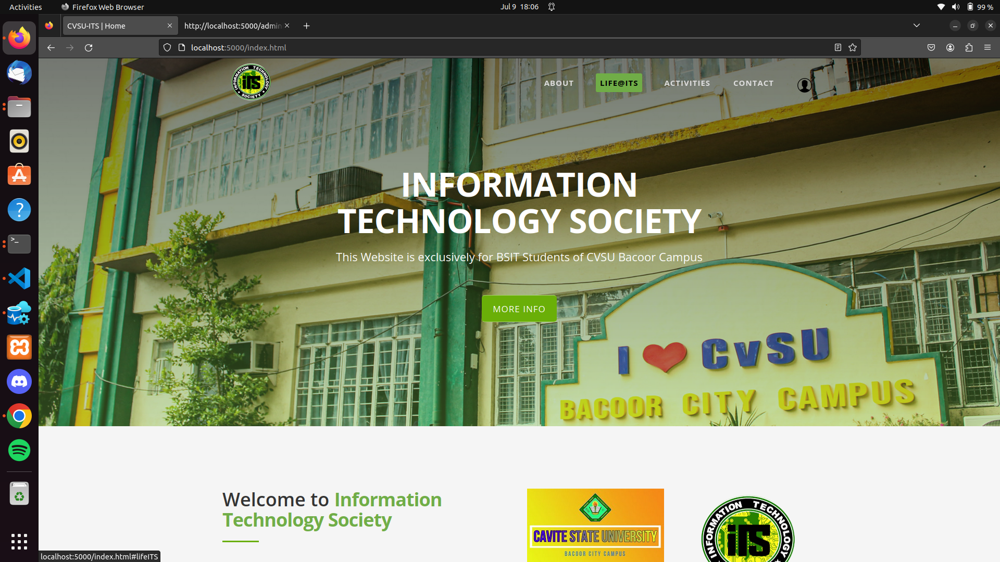
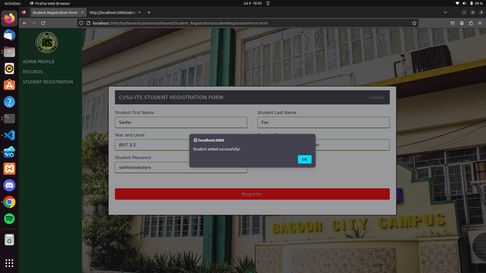
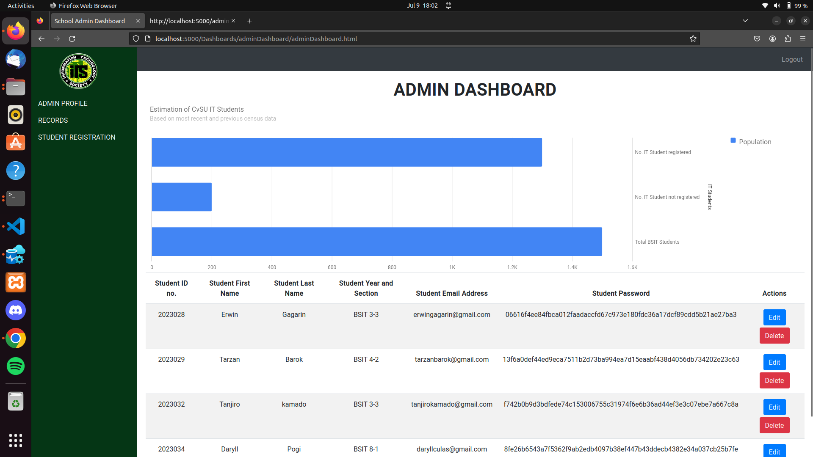
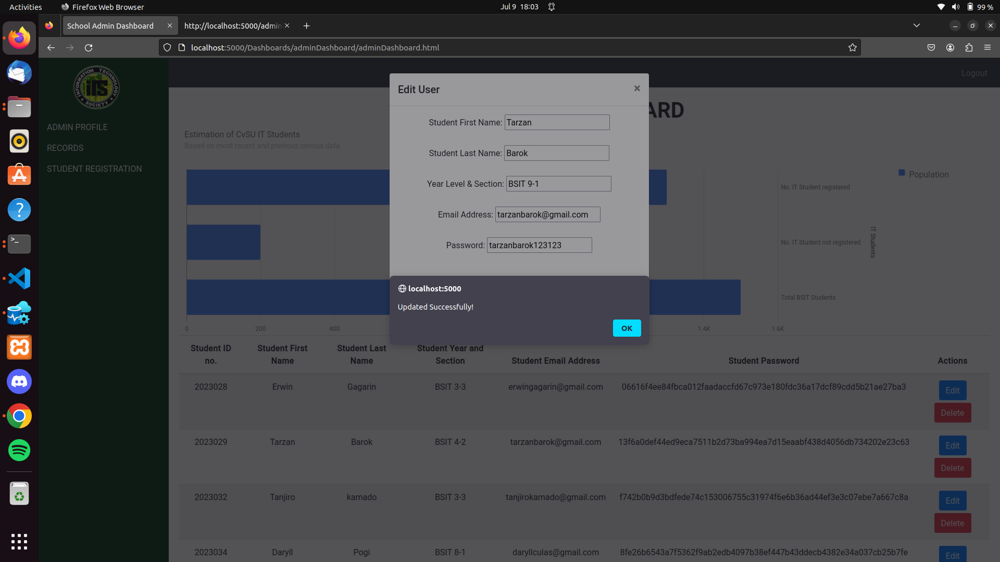
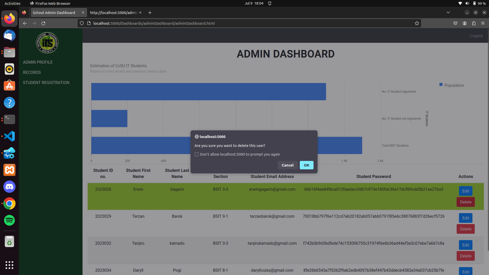
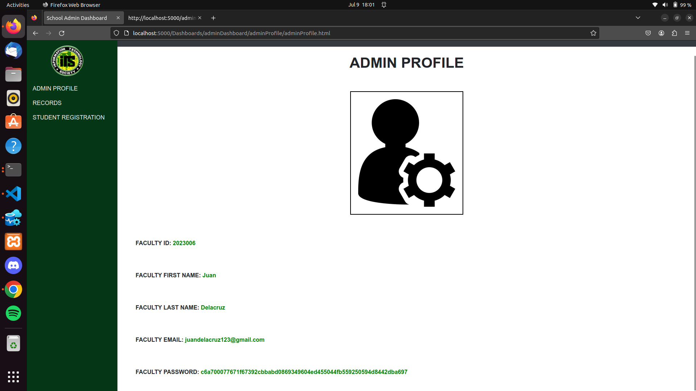
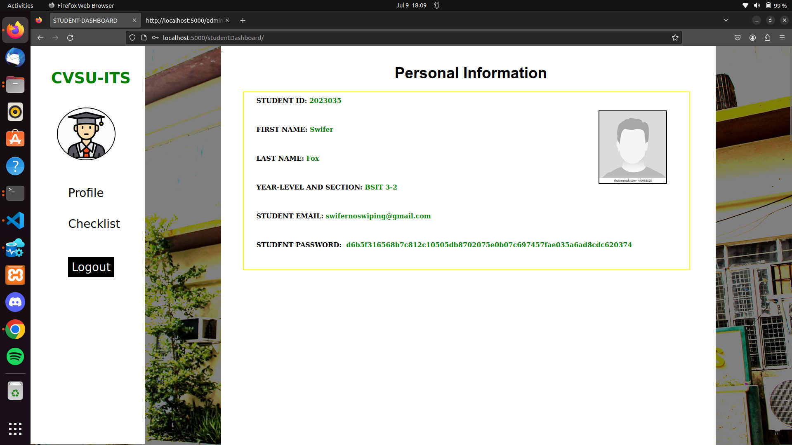

# CVSU-ITS Unofficial Website
This is school project only

# github repository & documentation: https://github.com/DaryllCulas/School_Project_1.git

# Project Name: BSIT Student Profiling System

This is an Unofficial Web System Application is exclusive for CVSU BSIT student in Bacoor Campus

Fork, then download or clone the repo.
```bash
  git@github.com:DaryllCulas/School_Project_1.git
  ```
# HOMEPAGE screenshot 


# CRUD screenshots
* Create

* Read

* Update

* Delete


# adminProfile


# studentProfile



# Prerequisites
* Node.js (LTS version) installed on your machine. You can download it from the official website: https://nodejs.org

# Installation
1. Clone or download the project to your local machine.
2. Open a command prompt (CMD) or PowerShell.
3. Navigate to the project folder using the cd command:
```bash
  cd path/to/project-folder
  ```

4. Install project dependencies by running the following command:
```bash
  npm install
  ```
5. Update the database connection details in the project's configuration file to match your Windows environment.

# Usage

1. Start the application by running the following command:
```bash
  npm start
  ```
2. Open a web browser and enter the appropriate URL or IP address to access the application.

# Troubleshooting
If you encounter any issues or errors during the installation or execution of the application, please feel free to contact me for assistance.


# Technologies used to develop this project
* HTML
* CSS
* Javascript
* ExpressJs
* NodeJS
* Azure Data Studio
* Docker container
* Ubuntu 22.04 - Desktop Environment
* git/github
* Mssql image latest-2019 for docker container
* VScode
* Mozilla Firefox - for debugging browser


##### Personal Notes ####### 
* Container id used: ebd933936e22 (Azure data studio running by docker container)
* Database used: Cvsu_ITS
* Table used: ITstudent(student table)
* Table used for admin role: adminFaculty (admin table)
* Server used: localhost


Package installation
* npm install express
* npm install axios
* npm install express-session
* npm install -g nodemon
* npm install mssql
* npm install express body-parser
* npm install tedious
* npm install unixodbc
* npm install path


